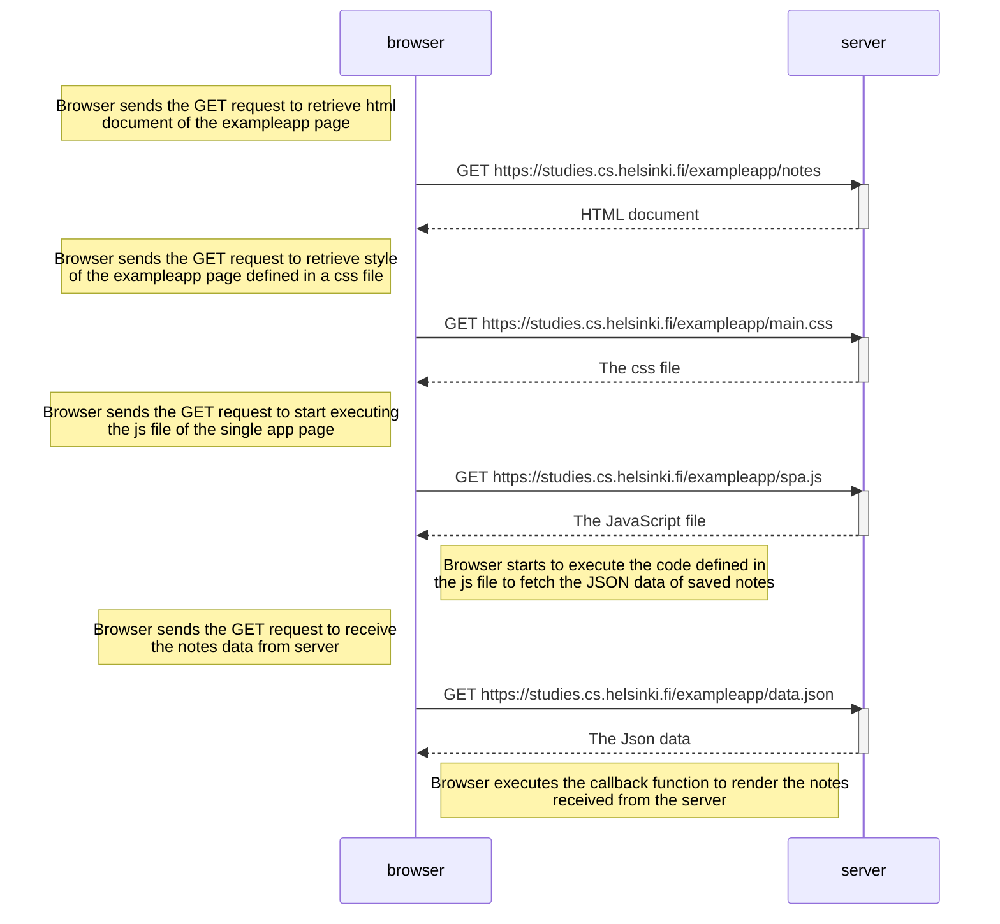

Here is a flow chart of opening the single page app version in https://studies.cs.helsinki.fi/exampleapp/spa:

```mermaid
sequenceDiagram
    participant browser
    participant server
    
    Note left of browser: Browser sends the GET request to retrieve html<br/>document of the exampleapp page
    browser->>server: GET https://studies.cs.helsinki.fi/exampleapp/notes
    activate server
    server-->>browser: HTML document
    deactivate server

    Note left of browser: Browser sends the GET request to retrieve style<br/>of the exampleapp page defined in a css file
    browser->>server: GET https://studies.cs.helsinki.fi/exampleapp/main.css
    activate server
    server-->>browser: The css file
    deactivate server

    Note left of browser: Browser sends the GET request to start executing<br/>the js file of the single app page
    browser->>server: GET https://studies.cs.helsinki.fi/exampleapp/spa.js
    activate server
    server-->>browser: The JavaScript file
    deactivate server
    Note right of browser: Browser starts to execute the code defined in<br/>the js file to fetch the JSON data of saved notes

    Note left of browser: Browser sends the GET request to receive<br/>the notes data from server
    browser->>server: GET https://studies.cs.helsinki.fi/exampleapp/data.json
    activate server
    server-->>browser: The Json data
    deactivate server
    Note right of browser: Browser executes the callback function to render the notes<br/>received from the server
```
